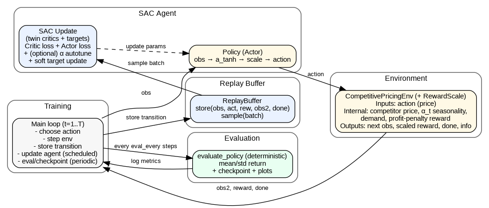
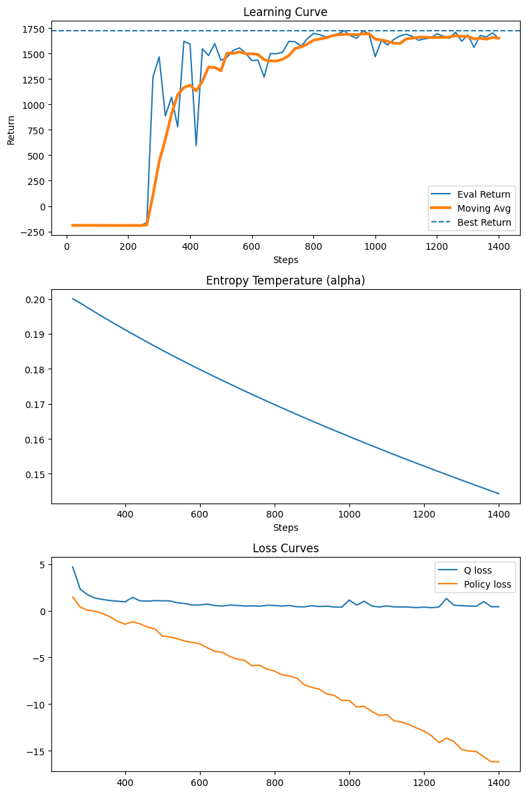
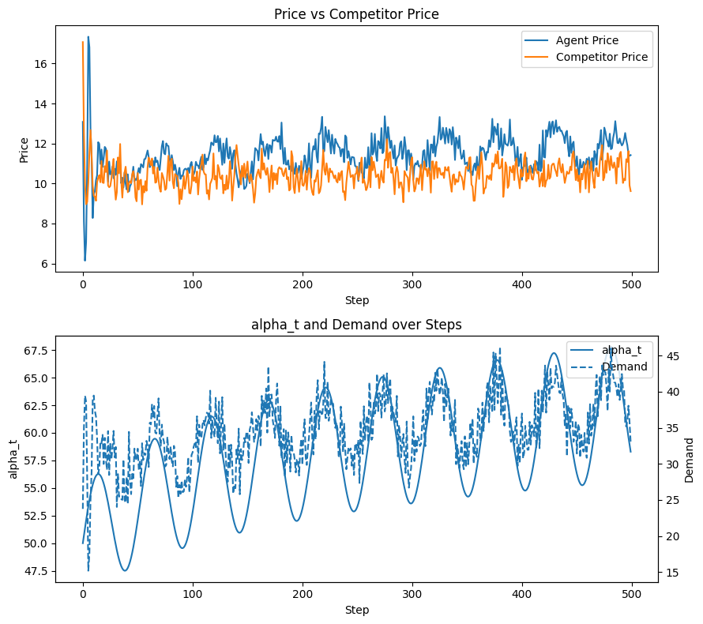

# Competitive Dynamic Pricing with Soft Actor-Critic

A reinforcement learning project for **competitive dynamic pricing under stochastic, partially observable market dynamics**. A Soft Actor-Critic (SAC) agent learns a continuous pricing policy while facing a reactive competitor, noisy demand, long-term market growth, and seasonality.

The project includes a custom Gymnasium environment, a modular SAC implementation in PyTorch, reproducible training and evaluation pipelines, checkpointing, experiment configuration through YAML, automated plots, tests, and an analysis notebook.

## Overview

At each time step, the agent chooses a price for a single product. A competitor then sets its own price using an autoregressive reaction model, demand is realized, and the agent receives profit minus a penalty for changing its price too aggressively.

The environment is **partially observable by default**: the latent market baseline contains trend and seasonality, but explicit time features are disabled in the default configuration. Instead, the policy receives a rolling history of agent prices, competitor prices, and realized demand and must infer the underlying market dynamics from that history.

The learning problem combines:

- continuous control over price,
- a stochastic and reactive competitor,
- noisy price-sensitive demand,
- non-stationary market size with growth and seasonality,
- a price-adjustment cost that encourages smooth policies,
- partial observability through hidden temporal market factors.

## Problem formulation

### Action

The action is a single continuous price

```math
p_t \in [p_{\min}, p_{\max}].
```

Under the default configuration,

```math
p_t \in [1, 50].
```

### Observation

The policy observes a rolling history of length $k$:

```math
o_t = \left[p_{t-k:t-1},\; p^c_{t-k:t-1},\; q_{t-k:t-1}\right].
```

With the default `k = 10` and `include_time_features: false`, the observation dimension is `30`.

If `include_time_features` is enabled, sine and cosine features for the seasonal phase are appended, increasing the observation dimension to `32` for the default history length.

### Competitor dynamics

The competitor follows a noisy autoregressive reaction model:

```math
p_t^c = a + \sum_{i=1}^{m} b_i p_{t-i} + \sum_{i=1}^{m} d_i p^c_{t-i} + u_t,
\qquad
u_t \sim \mathcal{N}(0, \sigma_c^2),
```

with the resulting price clipped to the configured competitor price range.

The default experiment uses `m = 1`, so the competitor reacts to the most recent agent and competitor prices.

### Market size

The latent baseline market size combines slow logarithmic growth with periodic seasonality:

```math
\alpha_t =
\left(\alpha_0 + g \log\left(1 + \frac{t}{T}\right)\right)
\left(1 + s\sin\left(2\pi\frac{t}{T} + \phi\right)\right).
```

By default, this quantity is **not directly observed** by the agent.

### Demand

Demand depends on the latent market size, the agent's price, the competitor's price, and Gaussian noise:

```math
q_t = \max\left(0,\; \alpha_t - \beta p_t + \eta(p_t^c - p_t) + \epsilon_t\right),
\qquad
\epsilon_t \sim \mathcal{N}(0, \sigma_d^2).
```

This captures both ordinary price sensitivity and a substitution effect: demand improves when the competitor becomes relatively more expensive.

### Reward

The raw reward is profit minus an absolute price-adjustment cost:

```math
r_t^{\text{raw}} = (p_t - c)q_t - \lambda |p_t - p_{t-1}|.
```

A reward wrapper then scales this value before it is stored in replay and used for learning:

```math
r_t = s_r \cdot r_t^{\text{raw}}.
```

The default reward scale is `0.01`.

## Reinforcement learning method



The agent uses **Soft Actor-Critic (SAC)**, an off-policy maximum-entropy actor-critic algorithm for continuous control.

The implementation includes:

- a squashed Gaussian actor,
- twin Q-critics,
- target critics with Polyak averaging,
- experience replay,
- automatic entropy-temperature tuning,
- reparameterized policy sampling,
- deterministic actions for evaluation.

The actor first samples an action in normalized `[-1, 1]` coordinates and then maps it to the environment's price range. Entropy is defined in these normalized action coordinates, so the standard target-entropy heuristic remains independent of the physical price units.

For a one-dimensional action space, the default target entropy is

```math
\mathcal{H}_{\text{target}} = -1.
```

The critic target is

```math
y_t = r_t + \gamma(1-d_t)
\left[
\min_{i\in\{1,2\}} Q_{\bar\theta_i}(o_{t+1}, a_{t+1})
- \alpha \log \pi(a_{t+1}\mid o_{t+1})
\right].
```

Only true MDP termination is used in the bootstrap mask. Episode truncation at the configured horizon ends the rollout but does **not** force the bootstrap target to zero.

## Default experiment

### Environment

| Parameter | Default | Meaning |
|---|---:|---|
| `horizon` | `500` | Steps per episode |
| `k` | `10` | Observation-history length |
| `m` | `1` | Competitor lag length |
| `p_min`, `p_max` | `1.0`, `50.0` | Agent price bounds |
| `unit_cost` | `2.0` | Per-unit cost |
| `adjustment_penalty` | `0.1` | Price-change penalty $\lambda$ |
| `alpha0` | `50.0` | Initial baseline market size |
| `alpha_growth` | `5.0` | Long-term growth strength |
| `alpha_seasonality` | `0.1` | Seasonal amplitude |
| `alpha_period` | `52` | Seasonal period |
| `beta` | `2.0` | Own-price demand sensitivity |
| `eta` | `1.0` | Competitor-price substitution effect |
| `demand_noise_std` | `2.0` | Demand-noise standard deviation |
| `competitor_intercept` | `5.0` | Competitor reaction intercept |
| `competitor_own_price_weight` | `0.2` | Response to the agent's lagged price |
| `competitor_lag_weight` | `0.3` | Competitor price persistence |
| `competitor_noise_std` | `0.5` | Competitor-noise standard deviation |
| `include_time_features` | `false` | Hide explicit seasonal phase |
| reward `scale` | `0.01` | Learning-reward scale |

### SAC

| Parameter | Default |
|---|---:|
| Discount factor `gamma` | `0.99` |
| Target update rate `tau` | `0.005` |
| Learning rate | `3e-4` |
| Hidden layers | `[256, 256]` |
| Batch size | `256` |
| Replay capacity | `1,000,000` |
| Initial entropy temperature | `0.2` |
| Automatic entropy tuning | enabled |
| Target entropy | `-1` when unspecified |
| Device | automatic CUDA/CPU selection |

### Training

| Parameter | Default |
|---|---:|
| Total environment steps | `1400` |
| Random-action warm-up | `200` |
| Update eligibility begins | step `100` |
| Update frequency | every step |
| Gradient updates per update step | `1` |
| Evaluation frequency | every `20` steps |
| Evaluation episodes | `5` |
| Checkpoint frequency | every `20` steps |

Because the default SAC batch size is `256`, optimization cannot actually begin until the replay buffer contains at least `256` transitions, even though `update_after` is set to `100`.

## Project structure

```text
rl-project/
├── assets/
│   ├── training_plots.png       # Training curves and SAC diagnostics
│   └── step_diagnostics.png     # Learned pricing and demand rollout
├── configs/
│   ├── env.yaml                 # Market and reward configuration
│   ├── sac.yaml                 # SAC hyperparameters
│   └── experiment.yaml          # Run, training, and output settings
├── src/
│   ├── agents/
│   │   ├── base_agent.py
│   │   ├── networks.py
│   │   └── sac_agent.py
│   ├── buffers/
│   │   └── replay_buffer.py
│   ├── environments/
│   │   ├── custom_env.py
│   │   ├── reward.py
│   │   └── wrappers.py
│   ├── evaluation/
│   │   ├── evaluator.py
│   │   ├── metrics.py
│   │   └── plots.py
│   ├── training/
│   │   ├── collector.py
│   │   ├── losses.py
│   │   └── trainer.py
│   ├── utils/
│   │   ├── checkpoint.py
│   │   ├── logger.py
│   │   └── seeding.py
│   ├── config.py
│   └── experiment.py
├── scripts/
│   ├── train.py
│   ├── evaluate.py
│   ├── sweep.py
│   └── visualize.py
├── tests/
├── notebooks/
│   └── analysis.ipynb
├── results/
│   ├── checkpoints/
│   ├── logs/
│   └── figures/
├── report.pdf
├── requirements.txt
└── pyproject.toml
```

## Installation

Python `3.11+` is required by the project configuration.

```bash
python -m venv .venv
source .venv/bin/activate
pip install -r requirements.txt
```

On Windows PowerShell:

```powershell
python -m venv .venv
.venv\Scripts\Activate.ps1
pip install -r requirements.txt
```

The main dependencies are Gymnasium, NumPy, PyTorch, pandas, Matplotlib, PyYAML, and pytest.

## Usage

All commands below should be run from the project root.

### Train the default experiment

```bash
python scripts/train.py
```

The CLI supports lightweight overrides without editing YAML files:

```bash
python scripts/train.py \
  --seed 7 \
  --run-name sac_pricing_seed7 \
  --total-steps 5000
```

For persistent experiment changes, edit:

- `configs/env.yaml` for the market and reward,
- `configs/sac.yaml` for SAC hyperparameters,
- `configs/experiment.yaml` for run and training settings.

### Evaluate a checkpoint

```bash
python scripts/evaluate.py \
  --checkpoint results/checkpoints/sac_pricing_seed0/agent_final.pt \
  --episodes 10
```

Evaluation uses deterministic actor actions and a fixed family of evaluation seeds so checkpoints can be compared under the same stochastic conditions.

### Run a multi-seed sweep

```bash
python scripts/sweep.py --seeds 0 1 2 3 4
```

Each seed is written to its own run directory.

### Regenerate figures

```bash
python scripts/visualize.py --run-name sac_pricing_seed0
```

This recreates the training and diagnostic-rollout figures from saved CSV logs.

### Analyze a run in Jupyter

```bash
jupyter notebook notebooks/analysis.ipynb
```

The notebook is intentionally **analysis-only**. Training remains in the CLI pipeline so experiments are easier to reproduce.

## Outputs

For a run named `sac_pricing_seed0`, the pipeline creates:

```text
results/
├── checkpoints/
│   └── sac_pricing_seed0/
│       ├── agent_step_20.pt
│       ├── agent_step_40.pt
│       ├── ...
│       └── agent_final.pt
├── logs/
│   └── sac_pricing_seed0/
│       ├── training.csv
│       ├── rollout.csv
│       └── run_config.json
└── figures/
    └── sac_pricing_seed0/
        ├── training.png
        └── rollout.png
```

`training.csv` records periodic evaluation returns, profit, entropy temperature, critic loss, actor loss, and elapsed time. `rollout.csv` stores a full deterministic diagnostic trajectory containing agent price, competitor price, market size, demand, profit, adjustment cost, and scaled reward.

Checkpoints store network parameters, target critics, optimizer states, and the automatic entropy-temperature state. The current training pipeline does **not** serialize the replay buffer or expose a resume-training CLI, so checkpoints should be treated as complete agent snapshots rather than exact full-process restarts.

## Tests

Run the test suite with:

```bash
pytest -q
```

The tests cover:

- environment API compliance and horizon truncation,
- action-bound enforcement,
- finite SAC update metrics,
- replay-buffer capacity and tensor shapes,
- checkpoint round trips,
- configuration loading.

## Results

The figures below summarize the 1,400-step experiment used for the project analysis. They show both the optimization behavior during SAC training and the learned pricing policy in a deterministic diagnostic rollout.

### Training dynamics



The evaluation return improves sharply once the replay buffer contains enough data for gradient updates, then settles near the best observed performance. At the same time, the automatically tuned entropy temperature decreases from roughly `0.20` to `0.144`, gradually shifting the policy from stronger exploration toward more exploitative behavior. The critic loss also falls substantially from its early-training values.

### Learned pricing behavior



After a short initial transient, the learned policy generally prices in the `10-13` range while adapting to a competitor that is typically around `9.5-11.5`. The lower panel shows the non-stationary latent market baseline alongside realized demand: demand remains noisy, but its broad movement tracks the seasonal and growing market process that the policy must infer from observation history.

## Limitations and possible extensions

This is a controlled research simulator rather than a production pricing system. Important limitations include a linear demand model, one product, no inventory constraint, and a competitor with a fixed stochastic reaction rule.

Natural extensions include:

- recurrent policies such as LSTMs or GRUs for partial observability,
- explicit ablations with and without seasonal time features,
- multiple competitors,
- learning or strategic competitors and multi-agent RL,
- nonlinear or data-driven demand models,
- inventory and capacity constraints,
- distribution-shift and robustness experiments,
- broader hyperparameter and multi-seed evaluation.

## Reference

The SAC implementation is based on the maximum-entropy actor-critic formulation introduced in:

> Tuomas Haarnoja, Aurick Zhou, Pieter Abbeel, and Sergey Levine. **Soft Actor-Critic: Off-Policy Maximum Entropy Deep Reinforcement Learning with a Stochastic Actor.** ICML 2018, arXiv:1801.01290.

## Authors

**Amirhesam Kamalpour**

**Fateme Roshani**  

Reinforcement Learning Final Project, School of Electrical and Computer Engineering, University of Tehran, 2026.
